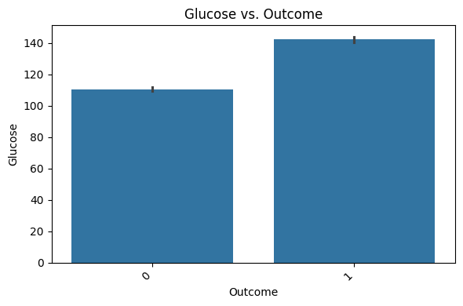

# Diabetes Prediction ML

This project develops a machine learning model to predict whether a patient has diabetes based on diagnostic health measurements. Early detection of diabetes is crucial for timely treatment and management, and this model aims to support that by providing accurate classification based on patient data.

## 📊 Dataset

- [Diabetes Dataset](https://drive.google.com/file/d/1rf9WR1RLC3ynMYybAp_p70JgwdcajDhq/view?usp=sharing), which contains several physiological features such as glucose level, BMI, blood pressure, and more, along with a binary outcome indicating diabetes presence.  
- [Data Dictionary](https://docs.google.com/document/d/1QNZHliysHgTINXNo-IUZHDhzKnpI7mfia4gaKJ-97tg/edit?tab=t.0) describing all features and their meanings is also provided.

---

## 📌 Project Workflow

### 🔹 Data Cleaning & Preparation
- Handled missing values with imputation.
- Checked and fixed inconsistent categorical values.
- Identified impossible numerical values and corrected them.
- Ensured all datatypes matched the dictionary specifications.

### 🔹 Exploratory Data Analysis (EDA)
- **Weight Group vs Outcome:** People are more likely to have diabetes as their weight group increases.
  

- **Glucose vs Outcome:** People with diabetes tend to have higher plasma glucose concentrations.
  

- **Correlation Heatmap:** Glucose showed the strongest correlation (r = 0.51) with diabetes outcome.
  

---

## ⚙️ Preprocessing

- Categorical variables were encoded using:
  - One-hot encoding for nominal categories
  - Ordinal encoding for ordered values (e.g., weight group)
- Feature scaling was applied to standardize values.
- All steps were wrapped in a pipeline to prevent data leakage.

---

## 🤖 Modeling
- Developed and compared multiple classification models to predict diabetes:
  - Logistic Regression (default & tuned)
  - K-Nearest Neighbors (default & tuned)
  - Random Forest Classifier (default & tuned)
- Applied hyperparameter tuning using GridSearchCV with 5-fold cross-validation.
- Used training and test splits to evaluate performance and avoid overfitting.

---

## 📊 Evaluation Summary

| Model                         | Accuracy | Recall (Diabetes class) |
|-------------------------------|----------|--------------------------|
| Logistic Regression (tuned)   | 72%      | 0.67                     |
| K-Nearest Neighbors (default) | 70%      | 0.69                     |
| **Random Forest (tuned)**     | **76%**  | **0.76**                 |

✅ **Final Model: Tuned Random Forest Classifier**

- Best performance on test data.
- Highest recall and F1-score for diabetic class.
- Balanced performance, minimal overfitting.
- Achieved AUC = 0.81 on test data.

### ROC Curve

---

## 🏁 Conclusion

Our final model, a tuned Random Forest Classifier, demonstrated strong and reliable performance in identifying patients likely to have diabetes. It correctly catch 76% of diabetic cases, balancing recall and precision well — a crucial factor in medical decision-making where false negatives can be costly.

---

## 🛠️ Technologies Used

- Python 3  
- Pandas, NumPy  
- Scikit-learn  
- Matplotlib, Seaborn  
- Google Colab

---

## 📄 License

This project is licensed under the **MIT License**.
